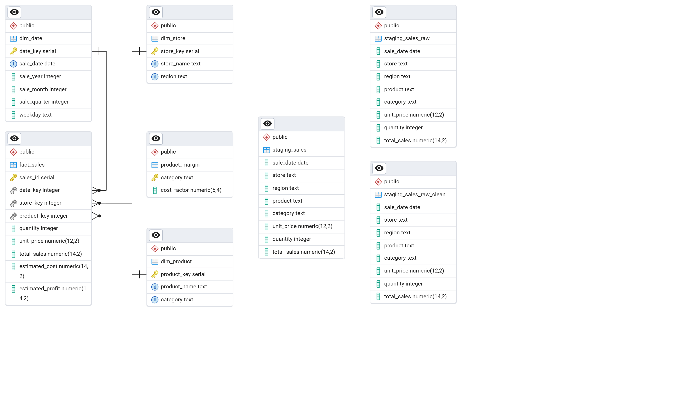

# SQL Workflow Overview

This folder contains the SQL scripts used for data loading, cleaning, and analysis 
for the Sales Performance Dashboard project.

## Files

### 1. create_tables.sql
- Creates required tables in the database
- Defines schema and data types
- Loads cleaned CSV data into database

### 2. cleaning_queries.sql
- Performs SQL-based data cleaning
- Removes duplicates
- Fixes data inconsistencies
- Validates numeric fields and date formats

### 3. sales_analysis_queries.sql
- Computes KPIs and business insights
- Generates:
  - Monthly sales
  - Product ranking
  - Regional performance metrics
  - Customer-level summaries

## Execution Order
1. Run create_tables.sql
2. Run populate_staging.sql
3. Run populate_margin.sql
4. Run cleaning_queries.sql
5. Run populate_dimensions.sql
6. Run populate_fact.sql
7. Run sales_analysis_queries.sql

## Recommended Database Engines
- DuckDB (fastest for local analytics)
- PostgreSQL (industry standard)
- SQLite (simple for demos)